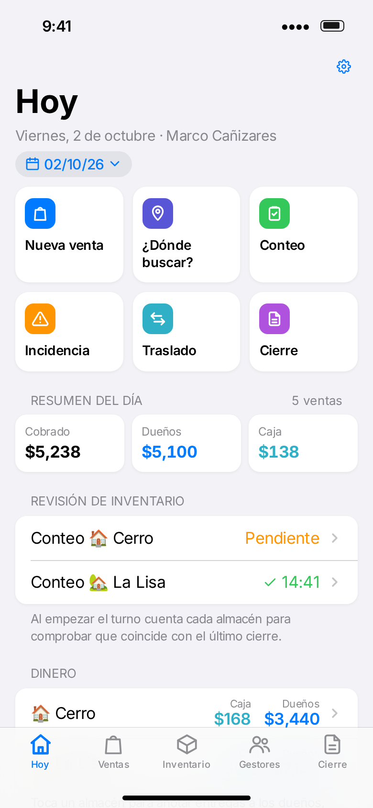
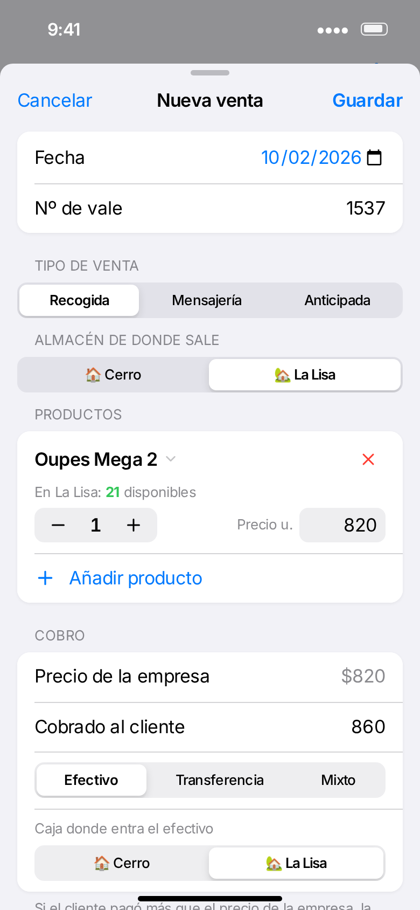
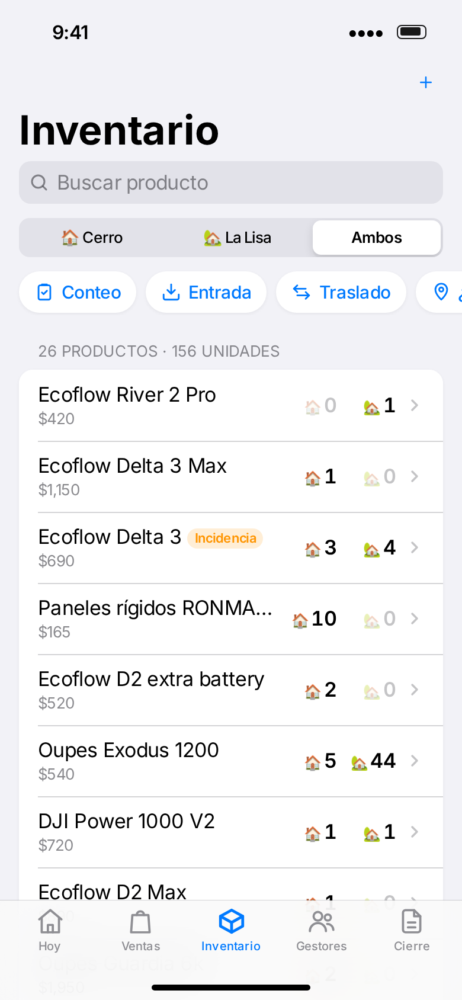
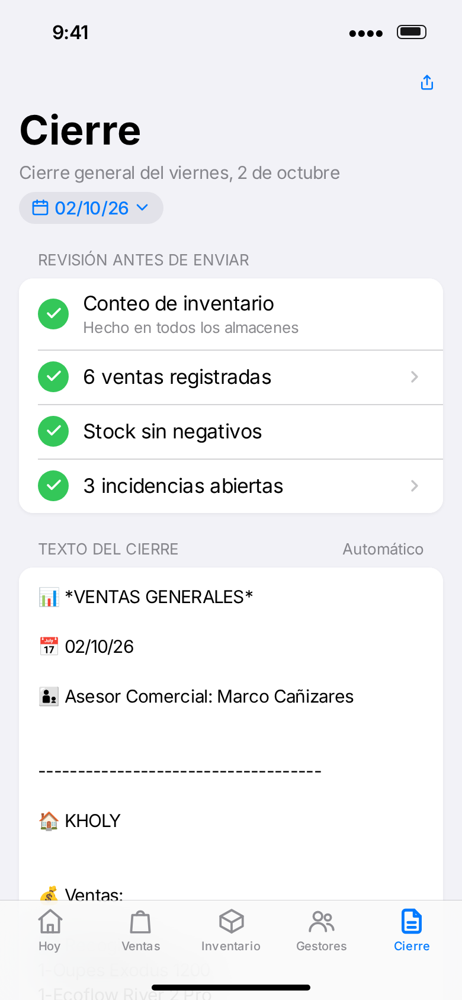

# Registro Ekotek

Web app para iPhone del **asesor de turno**: registra las ventas con su vale, descuenta el stock del almacén correcto, reparte el sobreprecio entre gestores y dueños, lleva el dinero de cada caja y las incidencias, y genera el **cierre general** listo para enviar por WhatsApp. Cada domingo calcula la **liquidación semanal** de gestores y asesores.

- 📱 Diseño de app nativa de iOS (modo claro y oscuro).
- ✈️ Funciona **sin internet** una vez instalada en la pantalla de inicio.
- 🔒 Los datos se guardan **solo en el iPhone** (no se suben a GitHub). Hay exportación/restauración de copias de seguridad.

**App:** https://marcoh03.github.io/registro_ekotek/
**Manual de uso:** [manual/Manual-Registro-Ekotek.pdf](manual/Manual-Registro-Ekotek.pdf)
**Capturas:** carpeta [`preview/`](preview/)

| Hoy | Nueva venta | Inventario | Cierre |
|---|---|---|---|
|  |  |  |  |

## Funciones

- **Ventas**: nº de vale, tipo (recogida, mensajería, compra anticipada), almacén, productos, cobrado al cliente, efectivo/transferencia/mixto y comisión de uno o varios gestores. Reparto automático entre **dueños** (precio de la empresa) y **caja** (sobreprecio, incluidas las comisiones de los gestores, que se pagan desde la caja); rebajas y combos los asumen los dueños. Cada venta guarda su precio, así que cambiar el catálogo no altera ventas pasadas. Editar, anular, eliminar y marcar anticipadas como entregadas.
- **Inventario** de Cerro y La Lisa calculado a partir de movimientos: ventas, entradas, traslados, salidas, ajustes y conteos, con historial por producto.
- **Conteo inicial** del turno con detección de diferencias e incidencias automáticas.
- **¿Dónde buscar?**: recomienda el almacén según el stock y la cercanía al municipio del cliente.
- **Importar el stock** pegando el texto de un cierre anterior y **fusionar** productos repetidos.
- **Dinero** por almacén en dos cuentas, **caja** y **dueños**: entregas a dueños, gastos, ingresos y arqueos en cualquiera de las dos.
- **Gestores**: saldo pendiente, deudas anteriores y ajustes, pagos (desde la caja por defecto), llamada y WhatsApp.
- **Liquidación semanal** (lunes–domingo): lo que se entrega a cada gestor y el % de comisión de cada asesor.
- **Cierre general** con el formato del grupo: ventas por punto de venta, stock, dinero en caja y de los dueños, comisiones pendientes de todos los gestores (también de días anteriores), compras anticipadas e incidencias. Editable, se guarda y se comparte.

Las actualizaciones conservan los datos del iPhone y las copias de seguridad de versiones anteriores se pueden restaurar.

## Publicar con GitHub Pages (una sola vez)

1. Fusiona esta rama en `main`.
2. En GitHub: **Settings → Pages → Build and deployment → Source: Deploy from a branch**, rama `main`, carpeta `/ (root)` → **Save**.
3. En un par de minutos la app estará en `https://marcoh03.github.io/registro_ekotek/`.

> GitHub Pages en repositorios **privados** requiere un plan de pago (GitHub Pro). Con una cuenta gratuita hay que hacer el repositorio **público**. El repositorio solo contiene el código y datos de ejemplo ficticios: tus ventas e inventario nunca salen del iPhone.

## Instalar en el iPhone

1. Abre la dirección de la app en **Safari**.
2. Botón **Compartir** → **Añadir a pantalla de inicio** → **Añadir**.
3. Ábrela siempre desde el icono. A partir de ahí funciona sin conexión.

## Estructura

```
index.html              Página principal (PWA)
manifest.webmanifest    Datos para instalar en la pantalla de inicio
sw.js                   Service worker: guarda la app para usarla sin internet
css/app.css             Estilos tipo iOS
js/store.js             Datos, guardado local y cálculos (stock, caja, comisiones)
js/closure.js           Texto del cierre general y de la liquidación semanal
js/sheets.js            Formularios y fichas (venta, conteo, caja, gestores…)
js/app.js               Pestañas y pantallas principales
js/ui.js, js/core.js    Componentes de interfaz y utilidades compartidas
icons/                  Iconos de la app
manual/                 Manual de uso en PDF
preview/                Capturas de pantalla con datos de ejemplo
tools/                  Scripts para regenerar iconos, capturas y manual
```

## Desarrollo

No hace falta compilar nada. Para probar en local:

```bash
npx http-server -p 8080 -c-1 .
```

Al publicar cambios, **sube la versión** de `VERSION` en `sw.js` (y `APP_VERSION` en `js/store.js`) para que los iPhone descarguen la versión nueva; la app mostrará el aviso “Hay una nueva versión”.

Regenerar capturas y manual (con el servidor local en marcha):

```bash
NODE_PATH=$(npm root -g) node tools/screenshots.cjs
DARK=1 NODE_PATH=$(npm root -g) node tools/screenshots.cjs
NODE_PATH=$(npm root -g) node tools/make-manual.cjs
```
